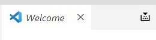
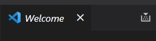

# Build Button

Adds a Build button to the Editor Toolbar (seen alongside the open document tabs).  
This button simply runs the default configured Built task, 
which is usually bound to <kbd>Ctrl</kbd>+<kbd>Shift</kbd>+<kbd>B</kbd>




The default build task will be configured in `.vscode/tasks.json` like so:

```
"tasks": [
  {
    "group": {
      "kind": "build",
      "isDefault": true
    }
```

## Known Issues

- The build button will still be present even when a default Build task is not configured. It will silently do nothing when clicked.

## Release Notes

### 0.1.0

Initial release

